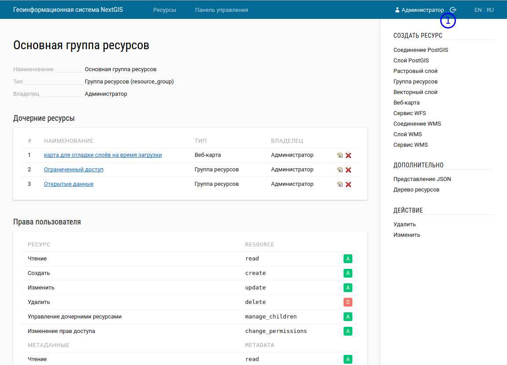
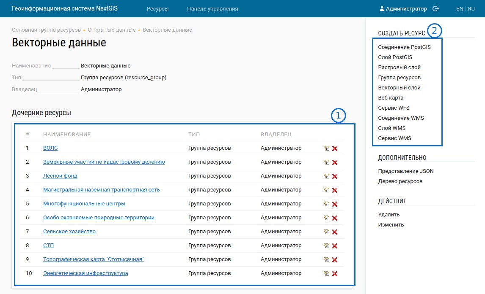
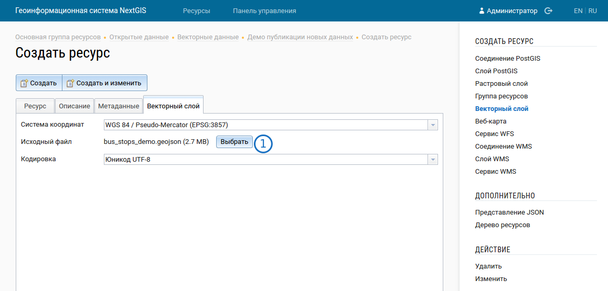
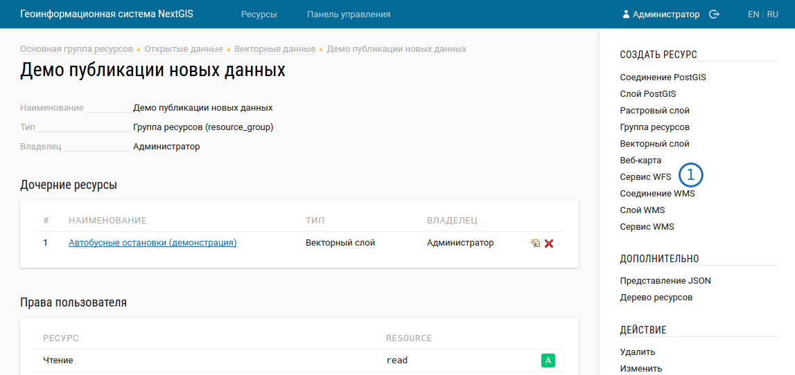
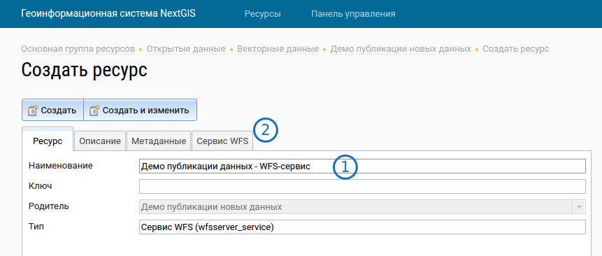

.. sectionauthor:: Дмитрий Барышников <dmitry.baryshnikov@nextgis.ru>

.. _ngogportal_editor:

Инструкция по размещению геоданных на портале
==============================================

Техническое описание
----------------------------------------------

Система состоит из двух веб-движков: :program:`CKAN` и :program:`NextGIS Web`. Эти серверные решения, к которым есть свои инструкции, при необходимости вы можете их найти в сети, но для размещения данных - достаточно данной инструкции.

:program:`CKAN` - веб-сервис для хостинга "открытых данных". :term:`Открытые данные` - это такое понятие, которое имеет законодательное определение. Вкратце - это данные в машинно-читаемом формате, размещаемые в сети, имеющие открытую лицензию, позволяющие их всем скачивать.
:program:`NextGIS Web` - это веб-сервис для хостинга "геоданных". Геоданные - это файлы (или базы данных), хранящие объекты с географическими координатами (как точками, так и линиями или фигурами). 
Изначально :program:`CKAN` мог хранить только табличные данные. При разработке портала его интегрировали с :program:`NextGIS Web` так, что он теперь может показывать геоданные - в нём появились карты, и возможность добавлять ссылки на разные форматы геоданных. Пользователь работает только с веб-интерфейсом :program:`CKAN`. В :program:`CKAN` хранятся ссылки на разные наборы данных, которые ведут в :program:`NextGIS Web`. Физически сами данные хранятся в :program:`NextGIS Web`. Туда грузится файл, а он предоставляет ссылки на скачивание или получение данных в разных форматах. Эти ссылки и размещаются в :program:`CKAN`. А оператор работает с веб-интерфейсом :program:`CKAN` и :program:`NextGIS Web`.

Краткое описание, для тех кто уже работал с :program:`NextGIS Web`
-----------------------------------------------------------

1. Взять файл в GeoJSON.
2. Загрузить в :program:`NextGIS Web`.
3. Создать в :program:`CKAN` набор данных, с названиями, описаниями и лицензией.
4. В :program:`CKAN` в наборы данных вставить ссылки на разные форматы данных, которые взять из :program:`NextGIS Web`.
5. Теперь в :program:`CKAN` можно будет смотреть геоданные на карте, и скачивать.

Размещение геоданных на портале
-------------------------------------------------

Вам потребуется:

А. Файл геоданных. Система принимает файлы в форматах GeoJSON, ESRI Shapefile (в zip-архиве). Если нет особых требований, то рекомендуется сохранять их в формате GeoJSON - с ним удобнее работать. Для подготовки файлов данных можно использовать NextGIS QGIS, или другие программы. Эти форматы широко распространены, и с ними работает множество ГИС.

Б. Адрес веб-интерфейса :program:`CKAN`.

В. Адрес веб-интерфейса :program:`NextGIS Web`.

Г. Логин и пароль от :program:`CKAN`.

Д. Логин и пароль от :program:`NextGIS Web`.

Е. Название лицензии, под которой публикуются данные. Если лицензию не указать, то формально данные не будут считаться открытыми.

Термины:

В :program:`NextGIS Web` данные делятся по каталогам - они называются "группы ресурсов". В группах ресурсов лежат слои.
В :program:`CKAN` лежат массивы данных, в массивах лежат данные. Как видим, структура похожая, только сущности называются по-разному.

1. Зайдите в веб-интерфейс :program:`NextGIS Web`. Введите логин и пароль. Если интерфейс не спросил логин - посмотрите вправо-вверх, какое имя пользователя написано. Если он не ваш - залогиньтесь.

   Веб-интерфейс NextGIS Web. 1 - ссылка на авторизацию.

2. Зайдите в группу ресурсов "Открытые данные" --> "Векторные данные". Зайтите там в нужный раздел, или создайте новый кнопкой "Создать группу ресурсов".

   Веб-интерфейс NextGIS Web. 1 - список групп ресурсов и слоёв. 2 - ссылки на создание ресурсов

3. Зайдите в нужную группу ресурсов, В блоке :guilabel:`Создать ресурс` нажмите :guilabel:`Векторный слой`. 

.. figure:: _static/admin_layers_create_vector_layer_resourse_description.png
   :name: admin_layers_create_vector_layer_resourse_description
   :align: center
   :width: 16cm

   Окно добавления векторного слоя.

В открывшемся окне введите Наименование. Переключитесь на вкладку :guilabel:`Векторный слой`. 

   Окно загрузки векторного слоя.

Укажите исходный файл (кнопка Выбрать,
см. :numref:`admin_layers_create_vector_layer_upload`).  

В качестве исходного файла можно загружать следующие форматы: 

* ESRI Shapefile в ZIP-архиве;
* GeoJSON.

.. note:: 
   Файл должен быть в кодировке UTF-8.
   Во входном файле не должно быть невалидных геометрий (в QGIS соответствующий 
   инструмент должен выдавать пустой список невалидных геометрий), даты не должны 
   иметь значения NULL, не должно быть полей с названиями: *id (ID), type(TYPE), source(SOURCE)*.
   Cистема координат геометрий должна распознается GDAL (вывод gdalinfo должен содержать описание СК). 

4. Теперь нужно создать для этого слоя векторный стиль - он будет использоваться для отображения по протоколу WMS. Зайдите в векторный слой. Нажмите ссылку "Создать MapServer style". Введите то же наименование, что и у слоя. Нажмите :guilabel:`Создать`. 

.. note::

   Стиль создастся с оформлением по умолчанию: все фигуры будут одного случайного цвета. При необходимости настроить цвета и подписи - см. инструкцию по :program:`NextGIS Web`. http://docs.nextgis.ru/docs_ngweb/source/mapstyles.html Однако эти стили возымеют действие только при подключении по WMS.

5. В наборе данных может быть один или несколько слоёв. Каждый слой раздаётся в разных форматах. Для каждого набора данных делается так же по одному "сервису WFS" и "сервису WFS", в которые помещаются все слои. 

После того, как вы добавили все слои в группу ресурсов перейдите в группу ресурсов, нажмите "Создать сервис WFS". 

Введите его название - такое же как у группы, с добавлением "WFS-сервис". Перейдите на вкладку :guilabel:`WFS-сервис`. Откроется список. Выберите в нём все добавившиеся слои из этой группы, и перетащите их. Затем выберите слева каждый слой, придумайте ему ключ латинскими буквами. 

Таким же образом добавте WMS-сервис, в него добавляйте не слои, а стили слоёв.

6. Зайдите в другой вкладке браузера в веб-интерфейс :program:`CKAN`. В нём пользователи и операторы работают с одними и теми же страницами, отдельной "админки" нету. Введите логин и пароль. Если интерфейс не спросил логин - посмотрите вправо-вверх, какое имя пользователя написано. Если он не ваш - залогиньтесь.

фигура. Показано, где в интерфейсе слои, где наборы и всё такое.

7. Зайдите в нужную группу. Создайте нужный набор данных, нажав на ссылку "***".

8. В этот набор данных нужно добавить ссылки на скачивание данных в различных форматах. Откройте в другой вкладке браузера в :program:`NextGIS Web` нужный ресурс.

Форматы
::::::::::::::::::::::::::::::

* GeoJSON - наведите мышью на ссылку "***". Нажмите правую кнопку --> Скопировать ссылку. Добавьте в :program:`CKAN` новый ***, укажите формат GeoJSON, вставьте ссылку. 
* ESRI Shapefile - наведите мышью на ссылку "***". Нажмите правую кнопку --> Скопировать ссылку. Добавьте в :program:`CKAN` новый ***, укажите формат GeoJSON, вставьте ссылку. У этого *** появится значок "Data".
* :program:`NextGIS Web` JSON - наведите мышью на ссылку "***". Нажмите правую кнопку --> Скопировать ссылку. Добавьте в :program:`CKAN` новый ***, укажите формат GeoJSON, вставьте ссылку. У этого *** появится значок "Data".
* CSV - наведите мышью на ссылку "***". Нажмите правую кнопку --> Скопировать ссылку. Добавьте в :program:`CKAN` новый ресурс, укажите формат GeoJSON, вставьте ссылку. 
* WFS - один на набор данных. Откройте WFS-сервис в :program:`NextGIS Web`, скопируйте гиперссылку. Добавьте в :program:`CKAN` новый ресурс, укажите формат WFS, вставьте ссылку. 
* WMS - один на набор данных. Откройте WFS-сервис в :program:`NextGIS Web`, скопируйте гиперссылку. Добавьте в :program:`CKAN` новый ресурс, укажите формат WMS, вставьте ссылку.

На этом операция размещения геоданных закончена. 

Как должны быть настроены права в :program:`NextGIS Web`
--------------------------------------------------

фигура. Настройка прав у корневой группы ресурсов

фигура. Настройка прав у группы ресурсов ***

фигура. Настройка прав у группы ресурсов ***

У ниже лежащих групп ничего дополнительно настраивать не надо, там будет вот так:

фигура. Настройка прав у группы ресурсов *** (или у слоя?)

Что выключать, если нужно убрать какие-то данные
-------------------------------------------------

#. В веб-интерфейсе :program:`CKAN` зайдите в ресурс, кнопку Manage, кнопку Удалить.
#. В веб-интерфейсе :program:`NextGIS Web` зайдите в ресурс. Вы можете удалить слой, в таком случае он удалится полностью, и восстановить его будет нельзя. Альтернативно, вы можете зайти в его настройки, и закрыть к нему доступ - см. http://docs.nextgis.ru/docs_ngweb/source/admin_tasks.html#access-rights
