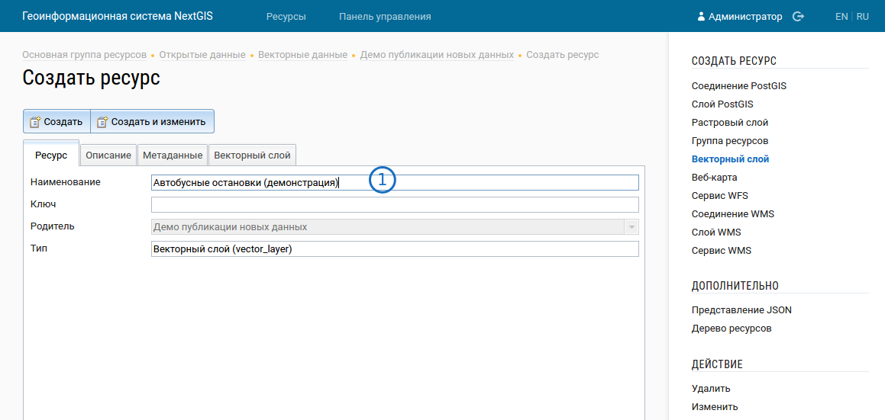

.. sectionauthor:: Дмитрий Барышников <dmitry.baryshnikov@nextgis.ru>

.. _ngogportal_editor:

Инструкция по размещению геоданных на портале
==============================================

Техническое описание
----------------------------------------------
ПО NextGIS Портал открытых геоданных включает в себя два компонента: CKAN и NextGIS Web. 
:term:`CKAN` - веб-сервис для хостинга "открытых данных". 
:term:`Открытые данные` - общедоступная информация в машиночитаемом формате, размещаемая 
в сети, имеющая открытую лицензию, позволяющая ее дальнейшую републикацию без ограничения 
авторского права и других механизмов контроля.
  
:term:`NextGIS Web` - это веб-сервис для хостинга "геоданных". 
:term:`Геоданные` - это файлы (или базы данных), хранящие объекты с географическими 
координатами (точками, линиями или фигурами) в формате, который может быть использован 
в географических информационных системах (ГИС).
 
Изначально :program:`CKAN` мог хранить только табличные данные. При разработке 
портала его интегрировали с :program:`NextGIS Web` так, что теперь он может 
показывать геоданные: в нём появились карты и возможность добавлять ссылки на 
разные форматы геоданных. Пользователь работает только с веб-интерфейсом 
:program:`CKAN`. В :program:`CKAN` хранятся ссылки на разные наборы данных, 
которые ведут в :program:`NextGIS Web`. Физически сами данные хранятся в 
:program:`NextGIS Web`, куда грузится файл, а :program:`CKAN` предоставляет ссылки на 
скачивание или получение данных в разных форматах. Эти ссылки и размещаются в 
:program:`CKAN`. А оператор работает с веб-интерфейсом :program:`CKAN` и 
:program:`NextGIS Web`.

Краткое описание для тех, кто уже работал с :program:`NextGIS Web`
------------------------------------------------------------------

1. Выбрать файл формата GeoJSON.
2. Загрузить в :program:`NextGIS Web`.
3. Создать в :program:`CKAN` набор данных с названиями, описаниями и лицензией.
4. В :program:`CKAN` в наборы данных вставить ссылки на разные форматы данных, которые 
   взять из :program:`NextGIS Web`.
5. Теперь в :program:`CKAN` можно будет смотреть геоданные на карте и скачивать.

Размещение геоданных на портале
-------------------------------------------------

Вам потребуется:

1. Файл геоданных. ПО NextGIS Портал открытых геоданных принимает файлы 
   в форматах :term:`GeoJSON`, :term:`ESRI Shapefile` (в zip-архиве). Если нет особых 
   требований, то рекомендуется сохранять их в формате GeoJSON - с ним удобнее работать. 
   Для подготовки файлов данных можно использовать NextGIS QGIS или другие программы. 
   Эти форматы широко распространены, и с ними работает множество :term:`ГИС`.
2. Адрес веб-интерфейса :program:`CKAN`.
3. Адрес веб-интерфейса :program:`NextGIS Web`.
4. Логин и пароль от :program:`CKAN`.
5. Логин и пароль от :program:`NextGIS Web`.
6. Название лицензии, под которой публикуются данные. Если лицензию не указать, 
   то формально данные не будут считаться открытыми.

В :program:`NextGIS Web` данные делятся по каталогам. Они называются "группы 
ресурсов". В группах ресурсов находятся слои.
В :program:`CKAN` содержатся массивы данных, в массивах имеются данные. 

1. Зайдите в веб-интерфейс :program:`NextGIS Web`. Введите логин и пароль. 
   Если интерфейс не запросил логин, посмотрите вправо-вверх, какое имя 
   пользователя указано. Если указан не ваш логин, войдите в программу в качестве 
   зарегистрированного пользователя под своим логином.

.. figure:: _static/ogportalNGWLogin.png
   :name: ogportalNGWLogin
   :align: center
   :width: 15cm

   Веб-интерфейс NextGIS Web. 1 - ссылка на авторизацию.

2. В середине экрана расположен список под названием "Дочерние ресурсы". В нём выберите 
   и откройте группу ресурсов "Открытые данные" --> "Векторные данные". Выберите в группе ресурсов 
   нужный раздел или создайте новый ссылкой "Создать ресурс" --> "Группа ресурсов".

.. figure:: _static/ogportalNGWGroups.png
   :name: ogportalNGWGroups
   :align: center
   :width: 15cm

   Веб-интерфейс NextGIS Web. 1 - список групп ресурсов и слоёв. 2 - ссылки на создание ресурсов.

3. Зайдите в нужную группу ресурсов. В блоке :guilabel:`Создать ресурс` нажмите 
   :guilabel:`Векторный слой`. В открывшемся окне введите Наименование. 
   Переключитесь на вкладку :guilabel:`Векторный слой`. 

   Окно добавления векторного слоя.

Укажите исходный файл (кнопка Выбрать, 
см. :numref:`admin_layers_create_vector_layer_upload`).  

.. figure:: _static/admin_layers_create_vector_layer_upload.png
   :name: admin_layers_create_vector_layer_upload
   :align: center
   :width: 15cm

   Окно загрузки векторного слоя.

В качестве исходного файла можно загружать следующие форматы: 

* ESRI Shapefile в ZIP-архиве.
* GeoJSON.

.. note:: 
   Файл должен быть в кодировке UTF-8.
   Во входном файле не должно быть невалидных геометрий (в QGIS соответствующий 
   инструмент должен выдавать пустой список невалидных геометрий), даты не должны 
   иметь значения NULL, не должно быть полей с названиями: *id (ID), type(TYPE), 
   source(SOURCE)*. Cистема координат геометрий должна распознаваться GDAL (вывод 
   gdalinfo должен содержать описание СК). 

4. Теперь нужно создать для этого слоя векторный стиль. Он будет использоваться 
   для отображения по протоколу WMS. Выберите векторный слой. Нажмите ссылку 
   "Создать MapServer style". 

Введите то же наименование, что и у слоя. 
Нажмите Создать. 

   Создание векторного стиля для слоя.

.. only:: latex
   
   .. note::
      Стиль создастся с оформлением по умолчанию: все фигуры будут одного случайного 
      цвета. При необходимости можно настроить цвета и подписи - 
      `Стили векторных слоев <http://docs.nextgis.ru/docs_ngweb/source/mapstyles.html#ngw-style-create>`_.
      Однако эти стили сработают только при подключении по WMS.

.. only:: html
   
   .. note::
      Стиль создастся с оформлением по умолчанию: все фигуры будут одного случайного 
      цвета. При необходимости можно настроить цвета и подписи - см. :ref:`ngw_style_create`.
      Однако эти стили сработают только при подключении по WMS.

5. В наборе данных может быть один или несколько слоёв. Каждый слой раздаётся в 
   разных форматах. Для каждого набора данных делается так же по одному "сервису 
   WFS" и "сервису WМS", в которые помещаются все слои. 

.. figure:: _static/ogportalNGWCreateWFS1.png
   :name: ogportalNGWCreateWFS1
   :align: center
   :width: 15cm

   Выбор сервиса/протокола для размещения данных.

После того, как вы добавили все слои в группу ресурсов, перейдите в группу 
ресурсов, нажмите "Создать сервис WFS". 

.. figure:: _static/ogportalNGWCreateWFS2.png
   :name: ogportalNGWCreateWFS2
   :align: center
   :width: 15cm

   Создание Сервиса WFS.

Введите его название - такое же как у группы, с добавлением "WFS-сервис". 
Перейдите на вкладку :guilabel:`WFS-сервис`. 

   Список ресурсов.

Нажмите кнопку :guilabel:`Добавить`. Откроется список, в нём - дерево всех ресурсов. 
Выберите в этом списке слой, который вы добавили на предыдущем шаге (как на картинке - 
выделите строку со значком папки).  
Нажмите :guilabel:`Ок`. Повторите добавление для всех новых слоёв.

.. figure:: _static/ogportalNGWCreateWFS4.png
   :name: ogportalNGWCreateWFS4
   :align: center
   :width: 15cm

   Выбор слоя и присвоение слою ключа латинскими буквами.

Затем выберите в списке слева каждый слой, присвойте ему ключ латинскими буквами. 

Таким же образом (:numref:`ogportalNGWCreateWFS1`, :numref:`ogportalNGWCreateWFS2`, :numref:`ogportalNGWCreateWFS3`, :numref:`ogportalNGWCreateWFS4`) добавьте WMS-сервис, в него добавляйте не слои, а стили слоёв.

6. Зайдите в другой вкладке браузера в веб-интерфейс :program:`CKAN`. В нём 
   пользователи и операторы работают с одними и теми же страницами, отдельного 
   административного интерфейса нет. Авторизуйтесь на сайте и выберите раздел "Пакеты данных".

   Веб-интерфейс :program:`CKAN`.

7. Зайдите в нужный пакет данных или создайте новый кнопкой :guilabel:`Создать набор данных`.
8. На странице нужного пакета данных нажмите :guilabel:`Manage`, затем перейдите на  вкладку :guilabel:`Ресурсы`.

9. В этот набор данных нужно добавить ссылки на скачивание данных в различных 
   форматах. Эти ссылки вам нужно скопировать из :program:`NextGIS Web`. Откройте 
   в другой вкладке браузера в нём нужный ресурс. Для примера добавим GeoJSON, как 
   наиболее распространённый формат. 

.. figure:: _static/ogportalADDGeoJSON.png
   :name: ogportalADDGeoJSON
   :align: center
   :width: 15cm

   Копирование адреса ссылки для скачивания файла формата GeoJSON.

В :program:`NextGIS Web` откройте векторный слой.
Справа страницы найдите ссылку "Загрузить GeoJSON", нажмите на неё правой кнопкой мыши, 
нажмите :guilabel:`Скопировать адрес ссылки`.
В CKAN нажмите :guilabel:`Add new resource`.

.. figure:: _static/ogportalADDGeoJSON2.png
   :name: ogportalADDGeoJSON2
   :align: center
   :width: 15cm

   Заполнение формы для скачивания данных (в данном случае файл формата GeoJSON).

1. В поле "URL" вставьте ссылку на скачивание GeoJSON.
2. В поле "Имя" введите название ресурса.
3. В поле "Формат" введите "GeoJSON", дождитесь появления всплывающего списка из одного 
   элемента и выберите в нём geojson.
4. Нажмите кнопку :guilabel:`Добавить`. :numref:`ogportalADDGeoJSON2`

Повторите данный пункт, добавив все форматы, перечисленные ниже.

Форматы
::::::::::::::::::::::::::::::

1. :term:`GeoJSON`. В NextGIS Web наведите мышью на ссылку "Загрузить GeoJSON". Нажмите правую кнопку --> Скопировать ссылку. Добавьте в :program:`CKAN` новый ресурс, добавьте ссылку, имя, укажите формат GeoJSON.
2. :term:`JSON`. В NextGIS Web наведите мышью на ссылку "Представление JSON". Нажмите правую кнопку --> Скопировать ссылку. Добавьте в :program:`CKAN` новый ресурс, добавьте ссылку, имя, укажите формат JSON.
3. :term:`CSV`. В NextGIS Web наведите мышью на ссылку "Загрузить CSV". Нажмите правую кнопку --> Скопировать ссылку. Добавьте в :program:`CKAN` новый ресурс, добавьте ссылку, имя, укажите формат CSV.
4. :term:`ESRI Shapefile`. В NextGIS Web наведите мышью на ссылку "". Нажмите правую кнопку --> Скопировать ссылку. Добавьте в :program:`CKAN` новый ресурс, добавьте ссылку, имя, укажите формат .
5. :term:`WFS` - один на набор данных. Откройте WFS-сервис в :program:`NextGIS Web`, скопируйте гиперссылку. Добавьте в :program:`CKAN` новый ресурс, добавьте ссылку, имя, укажите формат WFS. 
6. :term:`WMS` - один на набор данных. Откройте WFS-сервис в :program:`NextGIS Web`, скопируйте гиперссылку. Добавьте в :program:`CKAN` новый ресурс, добавьте ссылку, имя, укажите формат WFS.

На этом операция размещения геоданных закончена. 

Изменение ссылок на данные на портале
-------------------------------------------------

Если изменяется адрес сервера NextGIS Web, то в CKAN нужно поменять ссылки вручную. 
Эта операция делается через веб-интерфейс с одной особенностью, после изменения ссылки 
на csv нужно зайти в CKAN в Manage и далее Datastore --> Upload to Datastore .

Настройка прав в NextGIS Web
--------------------------------------------------------

   Настройка прав у корневой группы ресурсов.

   Настройка прав у группы ресурсов Открытые данные.

   Настройка прав у группы ресурсов Векторные данные.

У ниже лежащих групп ничего дополнительно настраивать не нужно.

Что выключать, если нужно убрать какие-то данные
-------------------------------------------------

#. В веб-интерфейсе :program:`CKAN` зайдите в ресурс, кнопку Manage, кнопку Удалить.
#. В веб-интерфейсе :program:`NextGIS Web` зайдите в ресурс. Вы можете удалить слой, в таком случае он удалится полностью, и восстановить его будет нельзя. Альтернативно, вы можете зайти в его настройки, и закрыть к нему доступ - см. http://docs.nextgis.ru/docs_ngweb/source/admin_tasks.html#access-rights
