.. sectionauthor:: Дмитрий Барышников <dmitry.baryshnikov@nextgis.ru>

.. _ngogportal_user:

Инструкция по использованию портала
==============================================

Данный портал обеспечивает процессы получения, подготовки, проверки и публикации 
открытых геопространственных данных, систематизации открытых данных, модификации 
свойств открытых наборов, а также отмены публикации данных. Вы можете просмотреть 
их в браузере или скачивать в виде файлов. Данные доступны в машиночитаемом формате, 
поддерживаемые современным софтом: NextGIS QGIS, ArcGIS, библиотеками GDAL.

* Если вы хотите ознакомиться с данными - просмотрите их в браузере по ссылке.
* Если вы хотите сохранить данные себе - скачайте файлы.
* Если вы хотите работать с данными в Open Office Calc / Microsoft Excel - скачайте 
  файлы в формате CSV.
* Если вы хотите заняться пространственным анализом данных - скачайте файлы в GeoJSON 
  или Shapefile.
* Если вы хотите разработать сервис, который будет показывать данные с портала на 
  вашей карте - передавайте информацию с помощью протоколов WMS, WFS, или, если 
  вам нужна высокая скорость - скачайте файлы.

Как смотреть геоданные на портале?
--------------------------------------

Вам потребуется:

1. Компьютер с доступом к cети Интернет.
2. Адрес портала - http://opendata25.primorsky.ru/ckan
3. Манипулятор "Мышь" или аналог.

1. Откройте в веб-браузере ссылку http://opendata25.primorsky.ru/ckan. Вы увидите 
главную страницу портала (см. :numref:`ogportalCKANUserIndex`). Нажмите на ссылку 
"Пакеты данных" или "Наборы данных".

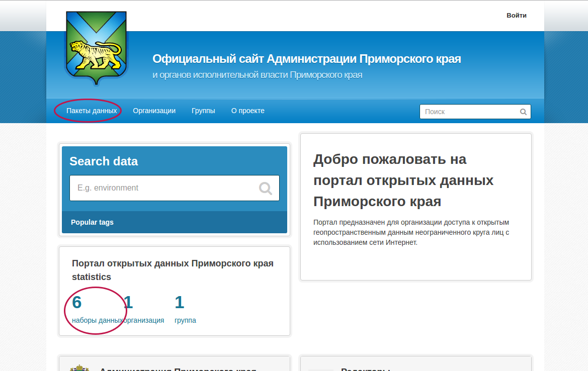

   Главная страница портала.

2. Вы увидите список массивов данных. Выберите название нужного вам массива данных.  (см. :numref:`ogportalCKANUserPacketsPage`). 

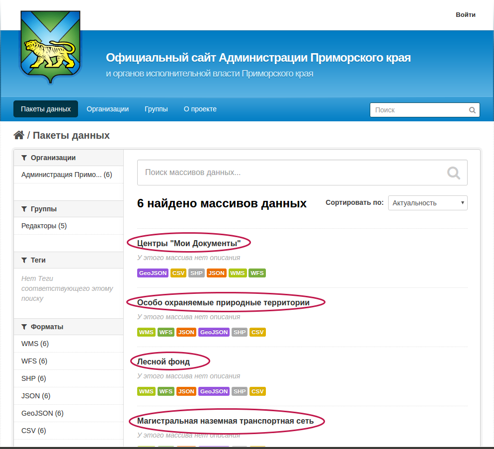

   Список пакетов данных.

3. В массиве данных находятся ресурсы. Вы увидите их список. Каждый набор данных 
представлен в нескольких форматах - эти форматы обозначаются значком слева: JSON, 
GeoJSON, Data, CSV.  Выберите нужный вам набор данных, (см. :numref:`ogportalCKANUserResourcesPage`) 
и нажмите на GeoJSON (см. :numref:`ogportalCKANGeoJSONIcon`). Этот формат наиболее 
удобно отображается в браузере. 

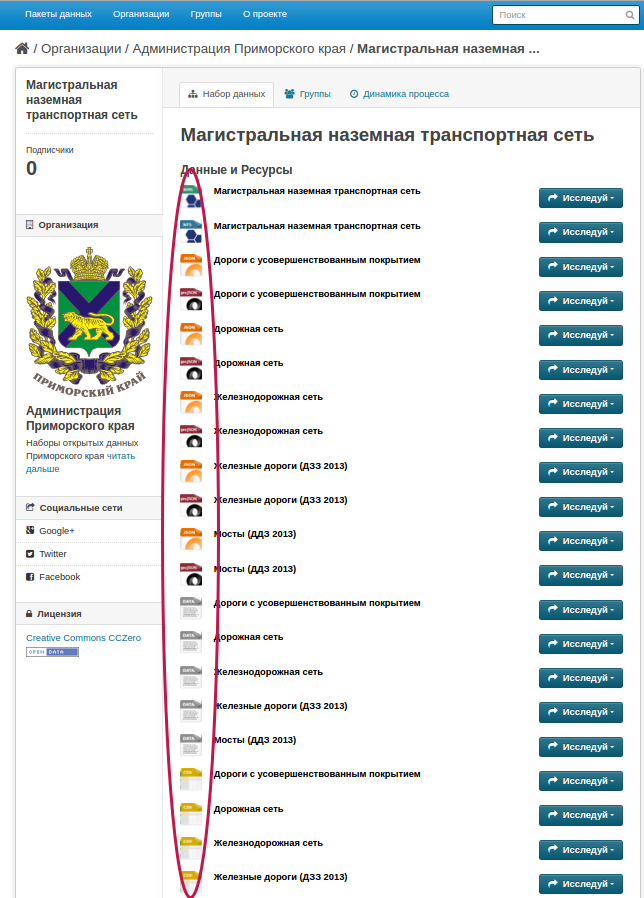

   Список ресурсов в массиве данных.

   Иконка GeoJSON (перенести в текст).

6. На экране появится карта (см. :numref:`ogportalCKANUserGeojsonWebmap`). Синим 
цветом на ней обозначены данные набора. 

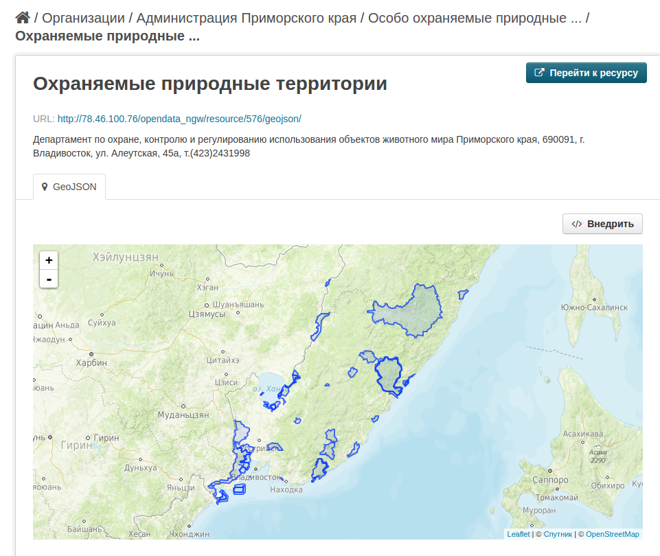

   Пример карты с наложенными данными.

7. Если необходимости просмотреть атрибуты объекта, нажмите мышкой на объект, и 
на экране появится окно с таблицей атрибутов объекта(см. :numref:`ogportalCKANUserGeojsonWebmapIdentify`). 
Этот процесс называется идентификацией.

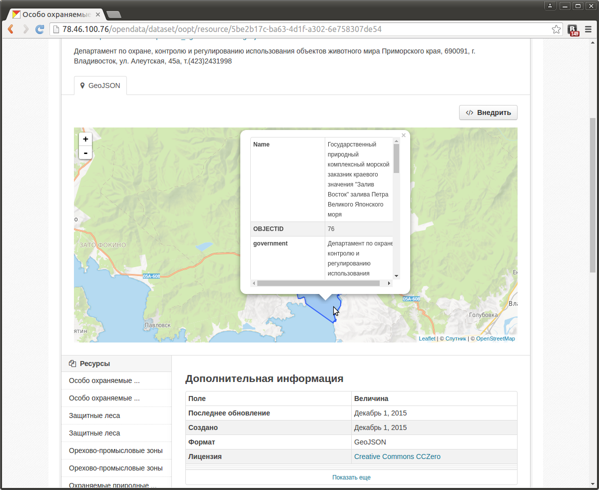

   Идентификация.

Как смотреть данные в таблице?
~~~~~~~~~~~~~~~~~~~~~~~~~~~~~~~~~~~~~~ 

1. Откройте данные в формате CSV:

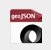

   Иконка CSV (перенести в текст).

2. На экране появится таблица данных (см. :numref:`ogportalCKANUserDataTable`):

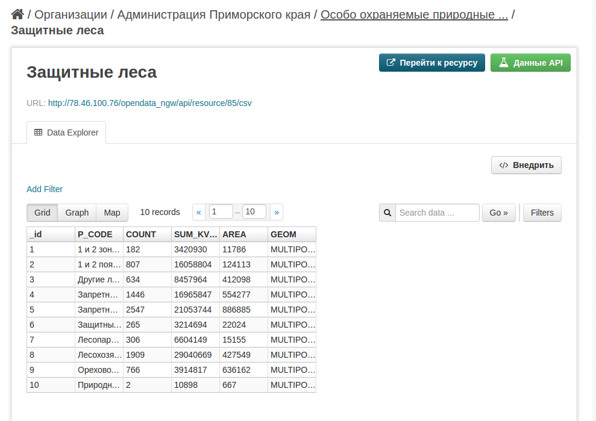

   Просмотр данных в таблице.

Как скачать данные в машиночитаемом формате?
-----------------------------------------------------------------

Выберите нужный вам набор данных и нажмите на значок нужного формата. Если у вас 
нет специальных требований, выбирайте формат GeoJSON, он открывается современными 
программами и не вносит ограничения на данные. 
На странице будет ссылка на скачивание файла.

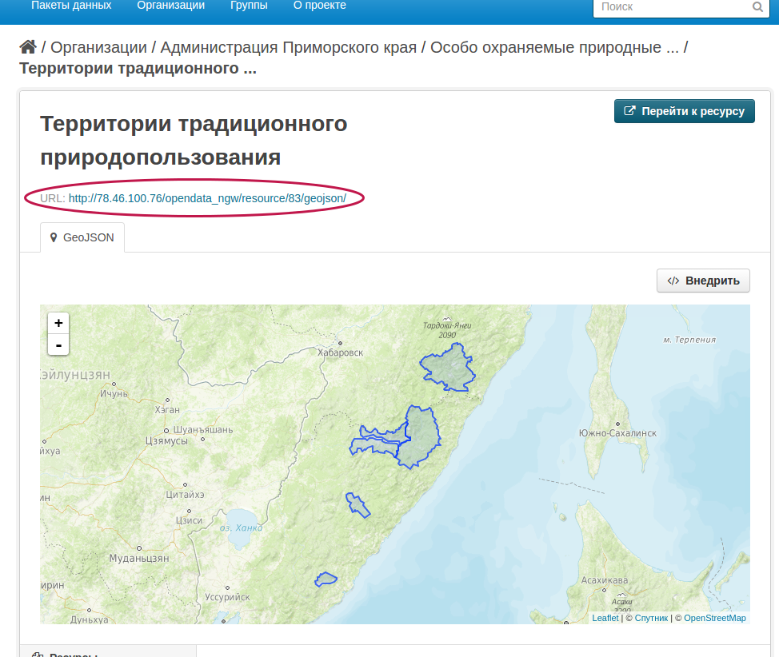

   Ссылка на скачивание карты.

Как открыть данные в машиночитаемом формате на компьютере?
--------------------------------------------------------------------

Рассмотрим на примере программы NextGIS QGIS. Это свободное программное обеспечение, 
распространяемое бесплатно. Точно таким же образом можно работать в программе QGIS 
на других операционных системах.

1. Сохраните файл в формате GeoJSON.
2. Откройте программу NextGIS QGIS.
3. Нажмите :menuselection:`Слой --> Добавить слой --> Добавить векторный слой`. (см. :numref:`ogportalQGISOpenGeoJSON1`), (см. :numref:`ogportalQGISOpenGeoJSON2`). 
В диалоге выберите скачанный вами файл в формате GeoJSON (см. :numref:`ogportalQGISOpenGeoJSON3`).

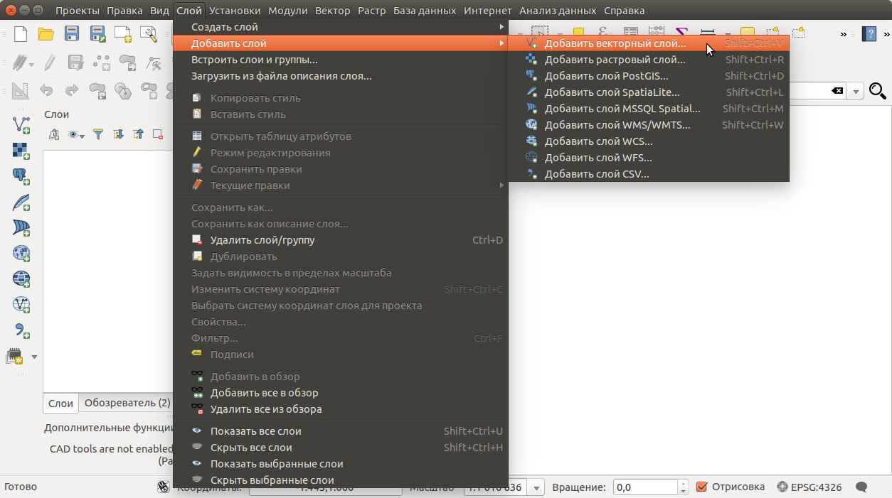

   Добавление векторного слоя. 

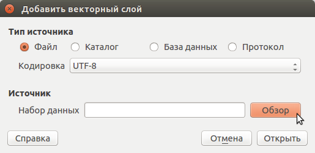

   Добавление векторного слоя.
 
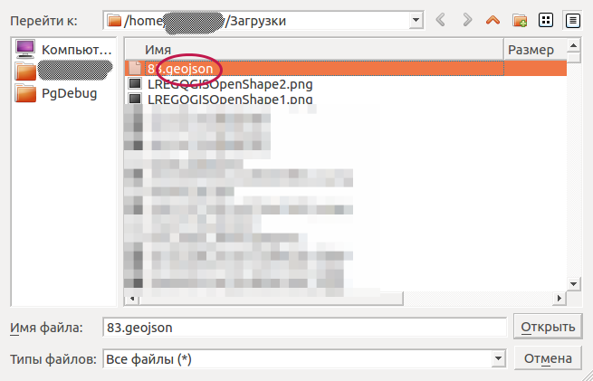

   Интерфейс QGIS. 

5. Выделите слой в списке слоёв и откройте таблицу атрибутов, выбрав в меню :menuselection:`Слой` ---> `Таблица атрибутов` (см. :numref:`ogportalQGISOpenGeoJSON4`).

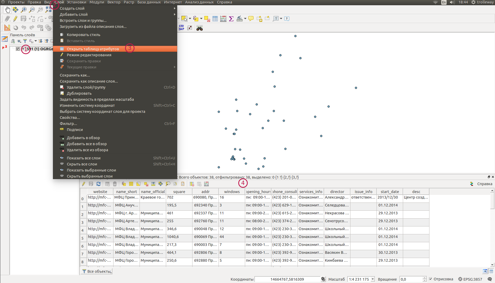

   Слой данных и таблица атрибутов.

Ссылка на QMS?
Таким образом геоданные можно открывать в программе для работы на компьютере.

Как открыть данные, если ПО не поддерживает GeoJSON?
---------------------------------------------------------------------

Скачайте данные в формате ESRI Shapefile (значок DATA). В этом формате данные распространяются 
в zip-архиве, который нужно распаковать и открыть в вашей программе файл .shp. 

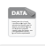

   Нажмите на эту ссылку.

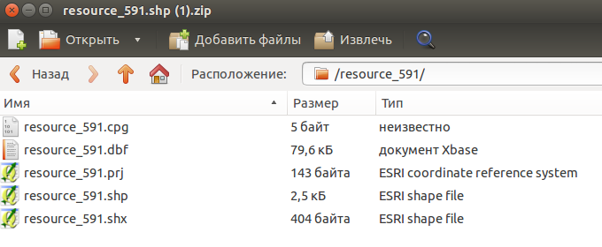

   Содержимое архива.

Как открыть данные в Calc или Excel на компьютере?
---------------------------------------------------------------------

1. Скачайте данные в формате CSV:

   Иконка CSV (перенести в текст).

2. Откройте файл в редакторе электронных таблиц. Укажите разделитель - запятая, 
и кодировку - Юникод (UTF-8). 

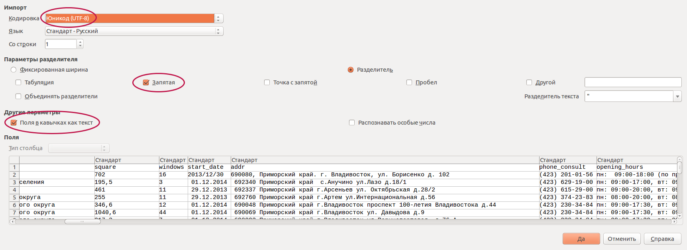

   Открытие CSV в Open Office Calc.

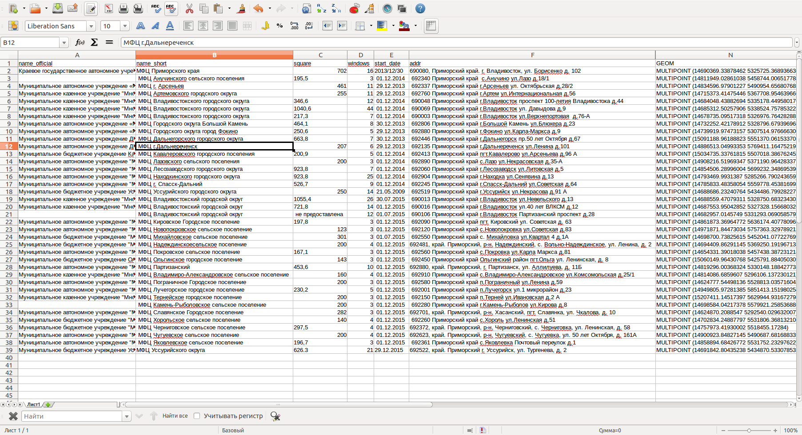

   Пример таблицы в Open Office Calc.

Краткие технологические сведения
------------------------------------
Портал состоит из CKAN - движка для публикации открытых данных, и NextGIS Web - веб-гис 
для хранения и показа геоданных. Сами данные хрянятся в NextGIS Web, в CKAN хранятся 
ссылки на их скачивание. NextGIS Web раздаёт их в виде файлов и по протоколам.

Описание форматов файлов (в конец)
~~~~~~~~~~~~

Файлы
::::::::::::::::

* GeoJSON - рекомендуемый к использованию.
* Esri Shapefile - старый формат из 90-х годов, понимаемый большим числом программного 
  обеспечения. Позволяет беспроблемно работать с большими объёмами данных, но имеются 
  ограничения на количество символов. В CKAN у него иконка "DATA".
* JSON - выдача из NextGIS Web в своём формате.
* CSV - текстовый файл с разделителями запятыми и координатами в формате WKT.

Протоколы
::::::::::::::::

* WFS - веб-сервис пространственных объектов, определяющий интерфейсы и операции, 
  которые позволяют запрашивать и редактировать векторные пространственные данные, 
  такие как дороги или береговые линии.

* WMS - протокол для трансляции через Интернет географически привязанных изображений, 
  генерируемых картографическим сервером на основе данных из произвольных хранилищ.

